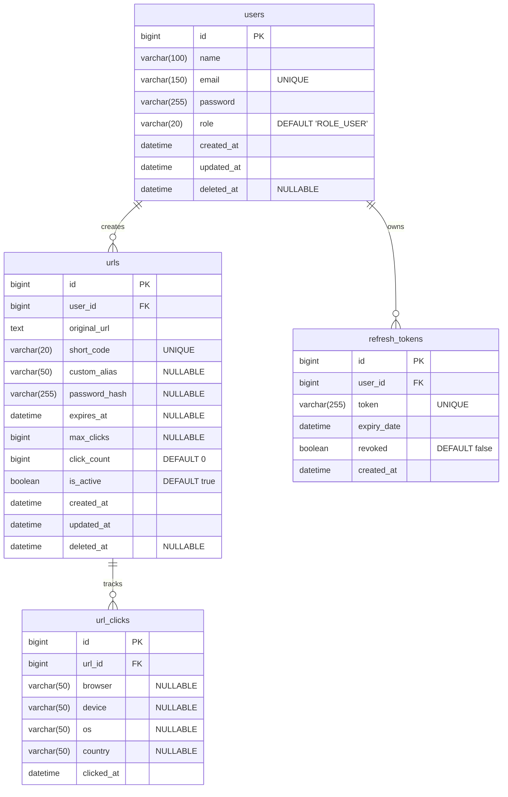

# 04 - Entity Relationship Diagram

## Schema Diagram

## Database Rules & Constraints

### Primary Keys
- All tables use `id` (`BIGINT`, `AUTO_INCREMENT`) as the primary key.

### Foreign Keys
- `urls.user_id` references `users.id`.
- `url_clicks.url_id` references `urls.id` (ON DELETE CASCADE).
- `refresh_tokens.user_id` references `users.id` (ON DELETE CASCADE).

### Indexes
- `idx_urls_user_id` on `urls(user_id)`
- `idx_urls_short_code` on `urls(short_code)`
- `idx_urls_created_at` on `urls(created_at)`
- `idx_url_clicks_url_id` on `url_clicks(url_id)`

### Unique Constraints
- `users(email)`
- `urls(short_code)`
- `refresh_tokens(token)`

### Cascade Rules
- **Soft Delete**: Deleting a User or URL is handled via an `@SQLDelete` annotation updating the `deleted_at` timestamp. 
- **Hard Deletes**: `url_clicks` and `refresh_tokens` are deleted automatically via SQL `ON DELETE CASCADE` if the parent entity is hard-deleted from the database.
