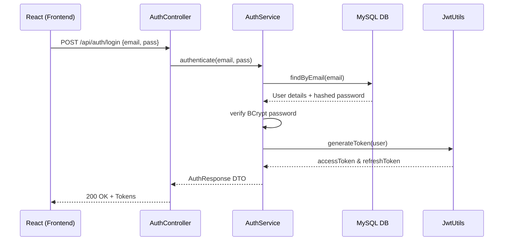
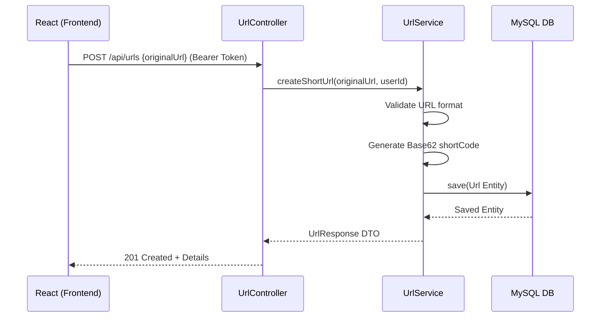
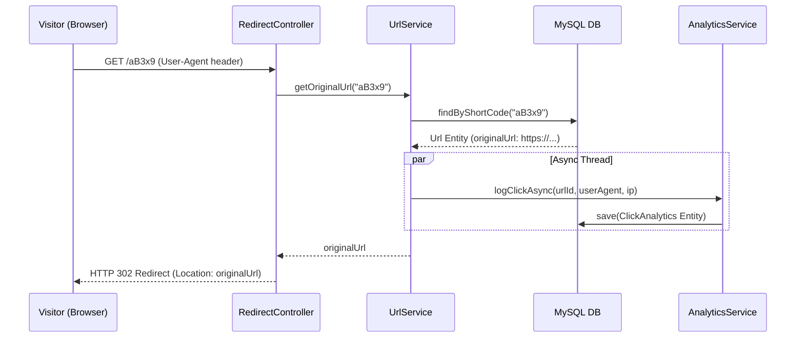

# 12 - API Sequence Diagrams

## 1. Login Flow

```mermaid
sequenceDiagram
    participant React as React (Frontend)
    participant AuthCtrl as AuthController
    participant AuthSvc as AuthService
    participant DB as MySQL DB
    participant JWT as JwtUtils

    React->>AuthCtrl: POST /api/auth/login {email, pass}
    AuthCtrl->>AuthSvc: authenticate(email, pass)
    AuthSvc->>DB: findByEmail(email)
    DB-->>AuthSvc: User details + hashed password
    AuthSvc->>AuthSvc: verify BCrypt password
    AuthSvc->>JWT: generateToken(user)
    JWT-->>AuthSvc: accessToken & refreshToken
    AuthSvc-->>AuthCtrl: AuthResponse DTO
    AuthCtrl-->>React: 200 OK + Tokens
```

## 2. Create URL Flow

```mermaid
sequenceDiagram
    participant React as React (Frontend)
    participant UrlCtrl as UrlController
    participant UrlSvc as UrlService
    participant DB as MySQL DB

    React->>UrlCtrl: POST /api/urls {originalUrl} (Bearer Token)
    UrlCtrl->>UrlSvc: createShortUrl(originalUrl, userId)
    UrlSvc->>UrlSvc: Validate URL format
    UrlSvc->>UrlSvc: Generate Base62 shortCode
    UrlSvc->>DB: save(Url Entity)
    DB-->>UrlSvc: Saved Entity
    UrlSvc-->>UrlCtrl: UrlResponse DTO
    UrlCtrl-->>React: 201 Created + Details
```

## 3. Redirect & Analytics Flow

```mermaid
sequenceDiagram
    participant Visitor as Visitor (Browser)
    participant RedirectCtrl as RedirectController
    participant UrlSvc as UrlService
    participant DB as MySQL DB
    participant AnalyticsSvc as AnalyticsService

    Visitor->>RedirectCtrl: GET /aB3x9 (User-Agent header)
    RedirectCtrl->>UrlSvc: getOriginalUrl("aB3x9")
    UrlSvc->>DB: findByShortCode("aB3x9")
    DB-->>UrlSvc: Url Entity (originalUrl: https://...)
    
    %% Async Analytics Logging
    par Async Thread
        UrlSvc->>AnalyticsSvc: logClickAsync(urlId, userAgent, ip)
        AnalyticsSvc->>DB: save(ClickAnalytics Entity)
    end
    
    UrlSvc-->>RedirectCtrl: originalUrl
    RedirectCtrl-->>Visitor: HTTP 302 Redirect (Location: originalUrl)
```
