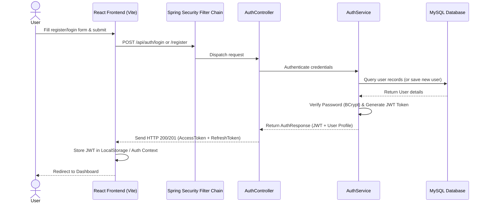
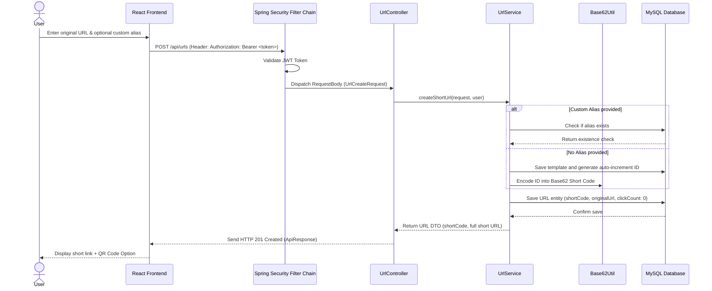
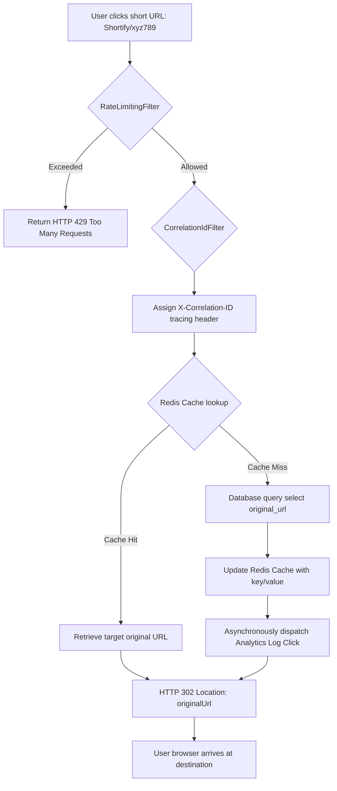
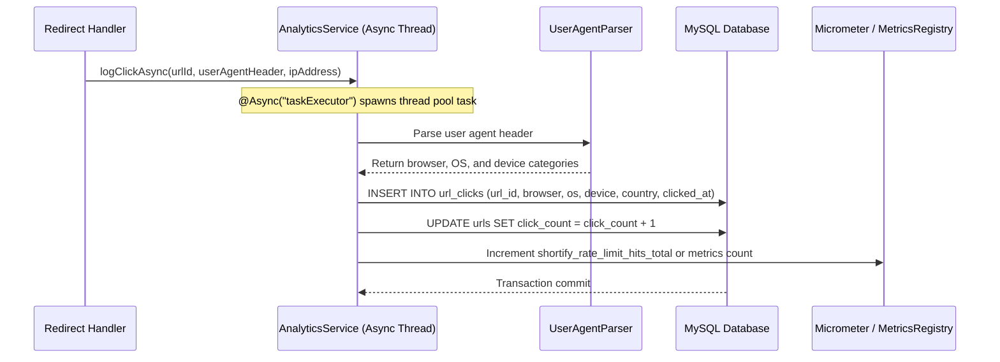
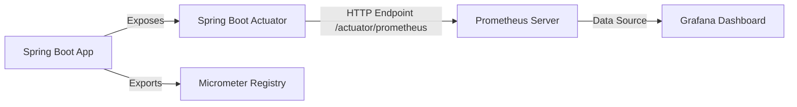
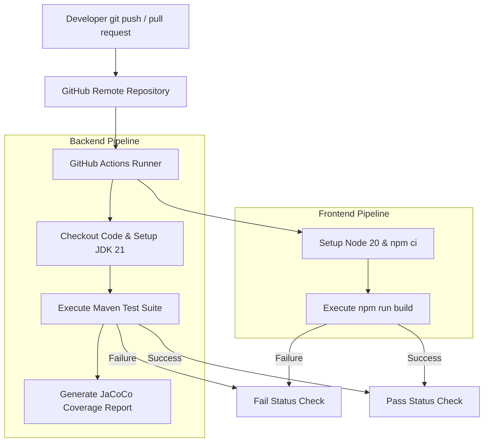

# Workflow Design (Application Flow)

This document maps out the runtime workflows and execution paths within Shortify.

---

## 1. User Authentication Workflow

Describes how a user registers or logs in, receives a JWT, and sends authenticated requests.

---

## 2. URL Creation Workflow

Describes the process of generating a shortened link, optionally using a custom alias.

---

## 3. Redirection Workflow

How short links are resolved and visitors redirected, utilizing Redis optimization.

---

## 4. Analytics Workflow

How click statistics (browser, OS, device, timestamps) are asynchronously recorded and processed.

---

## 5. Monitoring Workflow

Tracking application health, request throughput, and performance details.

---

## 6. CI/CD Workflow

The automated build, quality assurance, and deployment pipeline.

